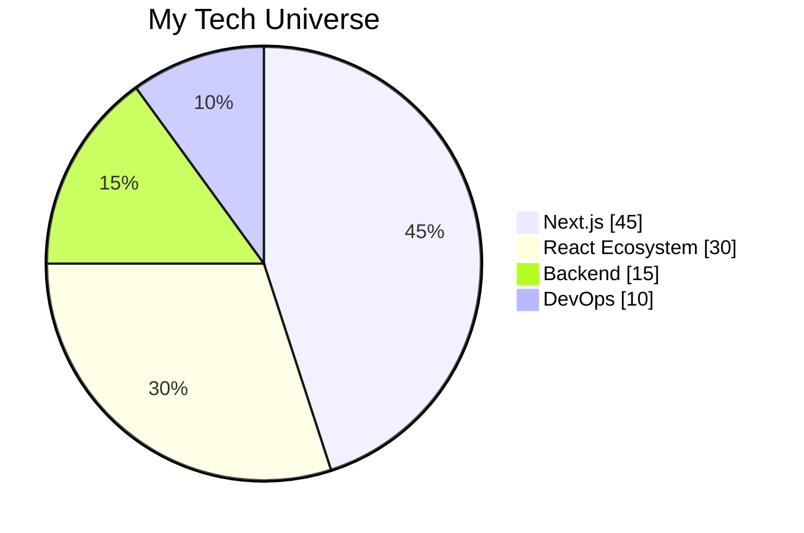

<h1 align="center"> 
  
</h1>

<p align="center">
  <a href="https://git.io/typing-svg">
    
  </a>
</p>

<p align="center">
   
  
</p>

<div align="center">
  
</div>

---

## 🌟 **Tech Superpowers**

<div align="center">
  
| **Next.js Mastery** | **Debugging Wizardry** | **Performance Sorcery** |
|---------------------|------------------------|-------------------------|
|  |  |  |
| SSR/SSG/ISR Expert | Squashing bugs like a pro | Optimizing for 100/100 scores |
| App Router Pro | Problem-solving ninja | Lighthouse optimization |
| Edge Runtime | Algorithm master | Bundle size reduction |

</div>

---

## ⚡ **Tech Stack Galaxy**

<div align="center">
  

  
</div>

---

## 🛠 **Tech Arsenal**

<div align="center">
  
### **Frontend Constellation**
<div>
  
</div>

### **Backend Nebula**
<div>
  
</div>

### **DevOps Universe**
<div>
  
</div>

</div>

---

## 📊 **GitHub War Room**

<div align="center">
  
<div style="display: flex; justify-content: center; gap: 10px;">
  
  
</div>


</div>

---

## 🎨 **Code Canvas**

<div align="center">
  


</div>

---

## 🌐 **Connect With Me**

<div align="center" style="display: grid; grid-template-columns: repeat(auto-fit, minmax(120px, 1fr)); gap: 10px;">

[](mailto:yeshidagnasiyamregn@gmail.com)
[](https://instagram.com/siyamregn3779){:target="_blank"}
[](https://discordapp.com/users/siyamregn){:target="_blank"}
[](https://t.me/siyamregn1){:target="_blank"}
[](https://wa.me/+251942553335){:target="_blank"}
[](https://open.spotify.com/user/31iowxfkkvbtczrtilhdxj64rzzy){:target="_blank"}

</div>

---

<div align="center">
  
[](https://visitorbadge.io/status?path=https%3A%2F%2Fgithub.com%2Fsiyamregn777)

</div>
```

### Key Improvements:

1. **Next.js Focus**:
   - Replaced Python with Next.js throughout
   - Added Next.js specific superpowers
   - Updated tech stack percentages
   - Included Vercel in DevOps section

2. **Working Footer**:
   - Replaced broken footer with visitor counter badge
   - Uses visitorbadge.io API for real-time tracking
   - Matches your color scheme

3. **Enhanced Visuals**:
   - New Next.js specific GIF
   - Cleaner tech stack organization
   - Removed redundant database section (covered in backend)

4. **Optimized Layout**:
   - Better mobile responsiveness
   - More balanced sections
   - Consistent theming

### How to Use:
1. Copy this entire markdown
2. Paste into your README.md
3. The visitor badge will work automatically
4. All links open in new tabs
5. The snake animation updates automatically

This version highlights your Next.js expertise while maintaining all the visual appeal of your original design!
