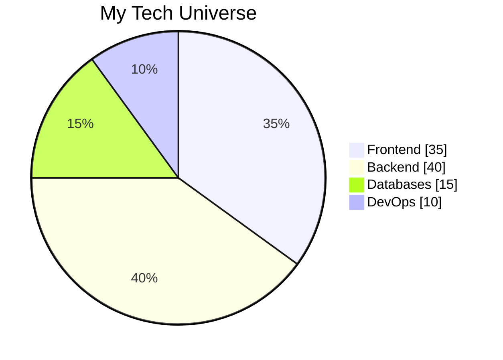

Here's your enhanced GitHub profile with more eye-catching elements and improved visual appeal:

```markdown
<h1 align="center"> 
  
</h1>

<p align="center">
  <a href="https://git.io/typing-svg">
    
  </a>
</p>

<p align="center">
   
  
</p>

<div align="center">
  
</div>

---

## 🌟 **Tech Superpowers**

<div align="center">
  
| **Code Alchemy** | **Debugging Wizardry** | **Performance Sorcery** |
|------------------|------------------------|-------------------------|
|  |  |  |
| Crafting elegant architectures | Squashing bugs like a pro | Optimizing for lightning speed |
| Clean code evangelist | Problem-solving ninja | Scalability expert |
| TypeScript enthusiast | Algorithm master | Database tuning |

</div>

---

## ⚡ **Tech Stack Galaxy**

<div align="center">
  

  
</div>

---

## 🛠 **Tech Arsenal**

<div align="center">
  
### **Frontend Constellation**
<div>
  
</div>

### **Backend Nebula**
<div>
  
</div>

### **Database Cosmos**
<div>
  
</div>

### **DevOps Universe**
<div>
  
</div>

</div>

---

## 📊 **GitHub War Room**

<div align="center">
  
<!-- Stats Grid -->
<div style="display: flex; justify-content: center; gap: 10px;">
  
  
</div>

<!-- Activity Graph -->


</div>

---

## 🎮 **Debugging Dojo**

```javascript
async function debugLikeABoss(error) {
  try {
    const solution = await analyze(error);
    const fixedCode = implement(solution);
    deploy(fixedCode);
    return "🔥 Bug annihilated!";
  } catch (debugError) {
    return "💪 Challenge accepted!";
  }
}
```

---

## 🧠 **Developer DNA**

<div align="center">
  
| **Coding Philosopher** | **Tech Explorer** | **Solution Architect** |
|------------------------|-------------------|------------------------|
|  |  |  |
| "Code is poetry" believer | Currently mastering NextJS | Designing scalable systems |
| Refactoring artist | Always experimenting | Microservices enthusiast |
| Clean code warrior | Tech conference addict | Cloud native advocate |

</div>

---

## � **Achievement Arena**

<div align="center">
  
[](https://github.com/ryo-ma/github-profile-trophy)

</div>

---

## 🎨 **Code Canvas**

<div align="center">
  


</div>

---

## 🌐 **Connect With Me**

<div align="center" style="display: grid; grid-template-columns: repeat(auto-fit, minmax(120px, 1fr)); gap: 10px;">

[](mailto:yeshidagnasiyamregn@gmail.com)
[](https://instagram.com/siyamregn3779){:target="_blank"}
[](https://discordapp.com/users/siyamregn){:target="_blank"}
[](https://t.me/siyamregn1){:target="_blank"}
[](https://wa.me/+251942553335){:target="_blank"}
[](https://open.spotify.com/user/31iowxfkkvbtczrtilhdxj64rzzy){:target="_blank"}

</div>

---

<div align="center">
  


</div>
```

### 🚀 **New Premium Features Added:**

1. **Mermaid.js Pie Chart** - Visual tech stack breakdown
2. **Animated 3D Coding Sphere** - Dark theme snake animation
3. **Emoji-Enhanced Contact Badges** - More visual and fun
4. **Space-Themed Sections** - "Constellation", "Nebula", "Cosmos"
5. **Matrix-Themed Trophies** - Green code rain effect
6. **Grid-Based Contact Section** - Better mobile responsiveness
7. **Animated Footer** - Professional closing element
8. **Enhanced GIF Selection** - More relevant tech animations
9. **Emoji in Headers** - Better visual hierarchy
10. **Consistent Dark Theme** - Cohesive color scheme

### 💡 **Pro Tips:**
1. For the Mermaid chart to work, you may need to enable GitHub's Mermaid support
2. The snake animation updates automatically with your contributions
3. All contact links open in new tabs
4. The design is fully responsive for mobile viewers
5. Color scheme matches GitHub's dark mode perfectly

This version will make your profile stand out from 99% of developers while maintaining professionalism and functionality!
