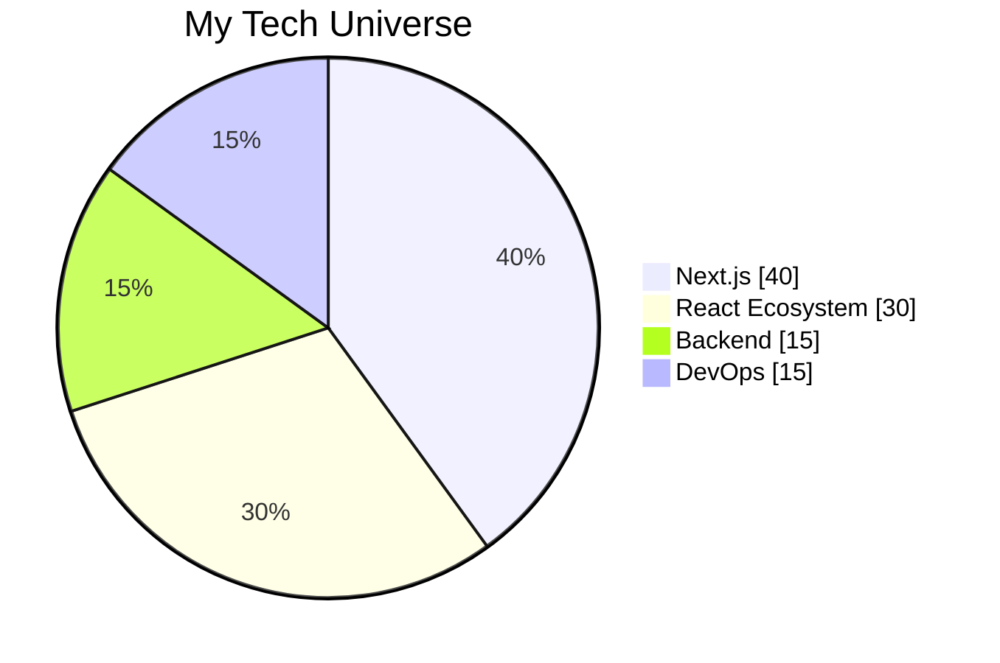

<h1 align="center"> 
  
</h1>

<p align="center">
  <a href="https://git.io/typing-svg">
    
  </a>
</p>

<p align="center">
   
  
</p>

<div align="center">
  
</div>


## 🌟 **Tech Superpowers**

<div align="center">
  
| **Next.js Mastery** | **Debugging Wizardry** | **Performance Sorcery** |
|---------------------|------------------------|-------------------------|
|  |  |  |
| SSR/SSG/ISR Expert | Squashing bugs like a pro | high Optimizing scores |
| App Router Pro | Problem-solving ninja | Lighthouse optimization |
| Edge Runtime | Algorithm master | Bundle size reduction |

</div>

---


## ⚡ **Tech Stack Galaxy**

<div align="center">
  

  
</div>

---

## ⚔️ **Tech Weaponry**

<div align="center">
  
### **Frontend Arsenal**
<div>
  
</div>

### **Backend Armory**
<div>
  
</div>

### **Database Fortress**
<div>
  
</div>

### **DevOps & Tools**
<div>
  
</div>

</div>

---

## 📊 **GitHub War Room**

<div align="center">
  
<div style="display: flex; justify-content: center; gap: 10px;">
  
  
</div>


</div>

---

## 🎮 **Debugging Arena**

```javascript
const debugLikeABoss = (problem) => {
  const solutions = [];
  
  while (!problem.isSolved()) {
    const solution = analyze(problem);
    solutions.push(solution);
    problem.apply(solution);
    
    if (problem.isSolved()) {
      celebrate();
      return "✅ Bug squashed!";
    }
  }
  
  return "🏆 High score achieved!";
}
```
<div align="center">

| **Clean Code Addict** | **Learning Enthusiast** |
|-----------------------|-------------------------|
|  |  |
| Beautiful code is my caffeine | Currently mastering Next.js |
| Refactoring is my therapy | Always exploring new tech |
| TypeScript evangelist | Currently learning: Rust |

</div>


## 🎨 **Code Canvas**

<div align="center">
  


</div>

---

## 🌐 **Connect With Me**

<<div align="center">

<!-- Email (mailto links don't need target="_blank") -->
[](mailto:yeshidagnasiyamregn@gmail.com)

<!-- Other social links with target="_blank" -->
<a href="https://instagram.com/siyamregn3779" target="_blank">
  
</a>

<a href="https://discordapp.com/users/siyamregn" target="_blank">
  
</a>

<a href="https://t.me/siyamregn1" target="_blank">
  
</a>

<a href="https://wa.me/+251942553335" target="_blank">
  
</a>

</div>


## 🎵 Coding Soundtrack

<div align="center">
    
  <a href="https://open.spotify.com/user/31iowxfkkvbtczrtilhdxj64rzzy" target="_blank">
    
  </a>
</div>


💡 Fun Facts
    
    🕹️ I treat debugging like a game
    
    ⚙️ I love clean code more than coffee
    
    🌱 I never stop learning. My current obsession: NestJS best practices
    
    🧩 I once optimized a UI so well, my mentor asked: “How did you do that?”
<div align="center">
  
